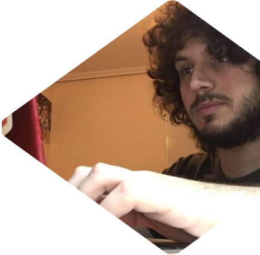

## Hola, soy Santi 🚀

- 😇 Software Engineer
- 📅 Cosas de comunidad en [@asturiasjs](https://twitter.com/asturiasjs)
- 🟣 "live coding" en http://santi.live 
- 🏀 Jugador de pachangas...
- 🎮 y de videojuegos 
- 🏗 Monto Legos...
- 🛋 y muebles de ikea 
- 🤔 Puedes preguntarme cosas sobre: JavaScript, TypeScript, firebase, react, NEXT.js, Google Cloud...
- 📝 Para contactarme utiliza [Twitter](https://twitter.com/SantiMA10b) (tengo los MD abiertos!)

---

## 🟣 Mis últimos directos en [Twitch](http://santi.live)

---

---

## ⭐️ Mis repos con más estrellas

- ⭐️⭐️⭐️ [tailwindcss-parcel-starter](https://github.com/SantiMA10/tailwindcss-parcel-starter) 48
- ⭐️⭐️ [devops-streamdeck](https://github.com/SantiMA10/devops-streamdeck) 42
- ⭐️ [lights](https://github.com/streamdevs/lights) 7

---

<i>¡Gracias a <a href="https://github.com/midudev" target="_blank"> midudev</a>, <a href="https://github.com/pablosirera" taget="_blank">Pablo Sirera</a> y <a href="https://github.com/carlosazaustre" target="_blank">Carlos Azaustre</a> por la inspiración!</i>

